# BOTSv3 (Splunk) — SOC Investigation Report (Q1–Q8)

This repository contains a SOC-style investigation write-up for **Splunk Boss of the SOC v3 (BOTSv3)** covering **300-level questions Q1–Q8**, including SPL queries, evidence references (Figures 1–14), and SOC interpretation + next steps.

---

## Table of Contents
- [1. SOC context, scenario and investigation goals](#1-soc-context-scenario-and-investigation-goals)
  - [1.1 SOC context](#11-soc-context)
  - [1.2 BOTSv3 scenario](#12-botsv3-scenario)
  - [1.3 Goals, scope and assumptions](#13-goals-scope-and-assumptions)
- [2. SOC roles and incident handling reflection](#2-soc-roles-and-incident-handling-reflection)
  - [2.1 Tiered responsibilities in this investigation](#21-tiered-responsibilities-in-this-investigation)
  - [2.2 Incident handling lifecycle mapping](#22-incident-handling-lifecycle-mapping)
- [3. Splunk deployment, onboarding, and data validation](#3-splunk-deployment-onboarding-and-data-validation)
  - [3.1 Deployment rationale (SOC view)](#31-deployment-rationale-soc-view)
  - [3.2 Data ingestion and readiness checks](#32-data-ingestion-and-readiness-checks)
- [4. Guided questions Q1–Q8](#4-guided-questions-q1q8)
  - [4.1 Summary table](#41-summary-table)
  - [4.2 Detailed analysis](#42-detailed-analysis)
- [5. Conclusion](#5-conclusion)
  - [5.1 Chain-of-evidence narrative](#51-chain-of-evidence-narrative)
  - [5.2 Detection engineering recommendations (SOC strategy)](#52-detection-engineering-recommendations-soc-strategy)
  - [5.3 Response playbook improvements](#53-response-playbook-improvements)
- [References](#references)
- [Appendix](#appendix)

---

## 1. SOC context, scenario and investigation goals

### 1.1 SOC context
A **Security Operations Centre (SOC)** is responsible for maintaining continuous security visibility, detecting abnormal behaviour, and coordinating incident response. Modern SOC work depends on correlating signals across identity, endpoint, email, cloud, and network domains. In real environments, analysts must be able to:
- move quickly from a weak signal to stronger evidence,
- confirm what happened, and
- propose containment + improvement actions that reduce risk going forward.  
[1]

### 1.2 BOTSv3 scenario
**Boss of the SOC v3 (BOTSv3)** is a Splunk-provided dataset/training environment that simulates an incident inside a fictitious company (**Frothly**). It includes multiple log sources such as:
- Microsoft 365 (cloud audit / management activity),
- SMTP traffic (email delivery and attachments),
- Sysmon (high-fidelity endpoint telemetry),
- Windows Security auditing (identity and privilege changes),
- osquery (endpoint state and process/network observations).

This mix is similar to what a SOC ingests in practice: cloud audit + email telemetry for entry, endpoint telemetry for execution and persistence, and identity telemetry for privilege escalation.  
[2]

### 1.3 Goals, scope and assumptions

#### Goals
1. Demonstrate a SOC-style workflow: validate Splunk access, confirm dataset visibility, and verify sources needed for investigation.
2. Answer BOTSv3 Q1–Q8 using SPL queries and evidence.
3. Translate each answer into SOC meaning (what it suggests, why it matters, what to do next).

#### Scope
- This report covers only **300-level questions Q1–Q8** using the evidence in **Figures 1–14**.

#### Assumptions
- Parsed fields shown in Splunk are accurate (timestamps and sourcetypes are correctly interpreted).
- BOTSv3 is treated as “ground truth telemetry” suitable for incident reconstruction, without performing external host forensics.

---
## 2. SOC roles and incident handling reflection

### 2.1 Tiered responsibilities in this investigation
SOC work is commonly separated into tiers:

**Tier 1 (Monitoring & triage)**
- Identify unusual behaviour, confirm whether it deserves escalation, and collect initial context (account, host, time window, key indicators).
- In BOTSv3, Tier 1 work includes recognising unusual User-Agent strings, suspicious attachments, and unusual ports.

**Tier 2 (Investigation & response)**
- Build a timeline across sources, determine the extent of compromise, confirm attacker actions (persistence, privilege escalation), and produce actionable response steps.
- In this case, Tier 2 correlation connects macro-enabled delivery → suspicious process → account creation → admin membership → listening service.

**Tier 3 (Detection engineering & threat hunting)**
- Convert what was learned into improved detections, dashboards, and response playbooks.
- For this dataset, that means creating correlation searches such as “new account + admin group add within 30 minutes,” and tuning baselines for rare User-Agents.

### 2.2 Incident handling lifecycle mapping
This investigation aligns with a standard incident handling lifecycle:

**Preparation (Prevent/Ready)**
- Ensure Splunk is operational, data is ingested, and key sourcetypes are available. Without this, later questions cannot be answered reliably.

**Detection & analysis**
- Identify indicators in cloud/email logs and confirm behavioural evidence in endpoint/identity logs.

**Containment & eradication**
- Derive what an analyst would do in a real SOC: isolate affected hosts, disable malicious accounts, remove elevated privileges, block hashes, and search for lateral spread.  
[1]

**Recovery & lessons learned**
- Strengthen correlation logic, tune alerting thresholds, and improve visibility gaps (e.g., ensure group management auditing is enabled and consistently monitored).  
[5]

---

## 3. Splunk deployment, onboarding, and data validation

### 3.1 Deployment rationale (SOC view)
The environment was run via a **VM-based setup**, reflecting SOC lab practice because it supports:
- repeatability (snapshots and stable configuration),
- isolation (safe testing without affecting production),
- controlled resource allocation.

**Operational evidence**
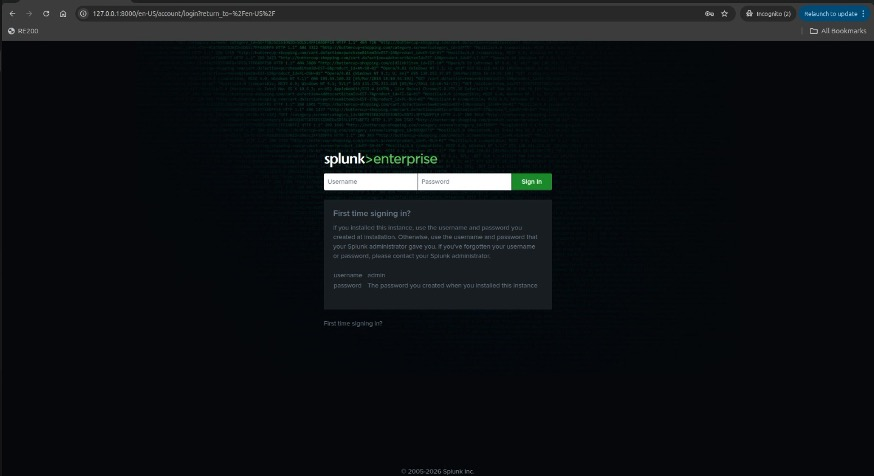
- Splunk web login page reachable (Fig. 1).
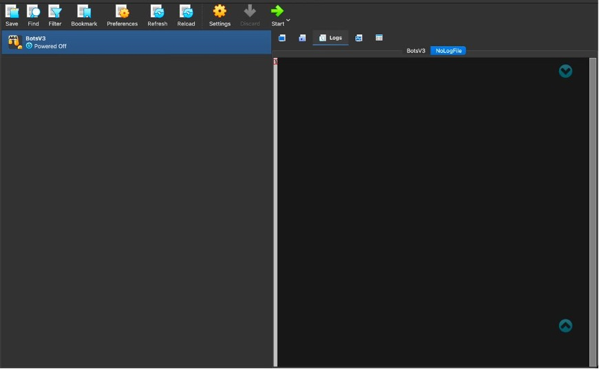
- VirtualBox VM exists and was used for BOTSv3 work (Fig. 2).

### 3.2 Data ingestion and readiness checks
A SOC analyst should not begin investigation until the following are verified:

**(A) Index visibility** — `index=botsv3 | head 10`  
**(B) Required sourcetype presence** — `index=botsv3 sourcetype="ms:o365:management" | head 5` ; `index=botsv3 sourcetype="stream:smtp" | head 5` ; `index=botsv3 sourcetype="XmlWinEventLog:Microsoft-Windows-Sysmon/Operational" | head 5` ; `index=botsv3 sourcetype="WinEventLog:Security" | head 5` ; `index=botsv3 sourcetype="osquery:results" | head 5`  
**(C) Field sanity examples** — `index=botsv3 sourcetype="WinEventLog:Security" EventCode=4720 | table _time host Account_Name EventCode` ; `index=botsv3 sourcetype="osquery:results" | table _time host name columns.cmdline columns.uid columns.owner_uid`

In a SOC, incorrect sourcetype parsing or time parsing breaks correlation and can cause false conclusions. In this assessment, successful search results across each domain (Figures 3–10) indicate that the dataset is sufficiently prepared for analysis.

---
## 4. Guided questions Q1–Q8

### 4.1 Summary table

| Q  | What was identified | Final Answer | Log source (domain) | Evidence |
|---:|---|---|---|---|
| Q1 | Suspicious User-Agent | `Mozilla/5.0 (X11; U; Linux i686; ko-KP; rv: 19.1br) Gecko/20130508 Fedora/1.9.1-2.5.rs3.0 NaenaraBrowser/3.5b4` UA string | O365 management (cloud) | Fig. 3 |
| Q2 | Malicious attachment filename | `Frothly-Brewery-Financial-Planning-FY2019-Draft.xlsm` | SMTP (email) | Fig. 4 |
| Q3 | Suspicious executable | `HxTsr.exe` | Sysmon (endpoint) | Fig. 5 |
| Q4 | Linux account created | `ilovedavidverve` | osquery (endpoint) | Fig. 6 |
| Q5 | Windows account created | `svcvnc` | Win Security (identity) | Fig. 7 |
| Q6 | Groups added to | `administrators,user` | Win Security (privilege) | Fig. 8 |
| Q7 | PID listening on port 1337 | `14356` | osquery (network/endpoint) | Fig. 9 |
| Q8 | MD5 hash | `586ef56f4d8963dd546163ac31c865d7` | Sysmon (endpoint) | Fig. 10 |

---
## 4.2 Detailed analysis

## Q1 — Suspicious User-Agent from O365 management activity

### Answer
Mozilla/5.0 (X11; U; Linux i686; ko-KP; rv: 19.1br) Gecko/20130508 Fedora/1.9.1-2.5.rs3.0 NaenaraBrowser/3.5b4

### SPL used
`index=botsv3 sourcetype="ms:o365:management" SourceFileExtension=lnk`

### Evidence

Fig. 3 and Fig. 4 show the relevant O365 event and context.

### SOC interpretation
A rare User-Agent is a practical cloud anomaly signal. SOC teams often baseline “normal” clients (Chrome/Edge/Office apps) and flag unusual strings, especially when paired with sensitive actions such as access to corporate SharePoint/OneDrive artefacts. Here, the UA suggests a non-standard browser and potentially a non-standard host profile. This would be treated as a triage-to-investigation escalation trigger: “Is this a legitimate device/app, or a threat actor using compromised credentials?”

### Next pivots a SOC would run
- Search for the same UA across time to assess scope.
- Pivot by user/account and compare IP geography and device patterns.
- Identify what objects were accessed (especially shortcuts or scripts).

---
## Q2 — Malicious attachment filename in SMTP logs

### Answer
Frothly-Brewery-Financial-Planning-FY2019-Draft.xlsm

### SPL used
`index=botsv3 sourcetype="stream:smtp" "attach_filename{}"="Malware Alert Text.txt"`

### Evidence
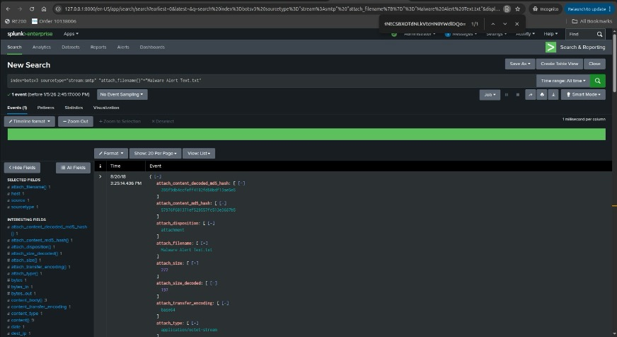
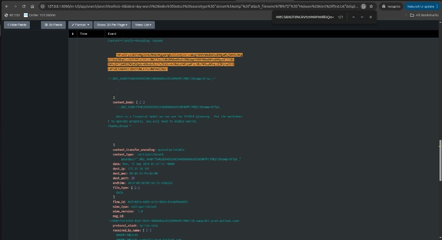
Fig. 5 and Fig. 6 show the SMTP event and the attachment-related content.

### SOC interpretation
Macro-enabled Office documents (.xlsm) are common initial payload containers. In a real SOC, the key investigative question becomes: “Did any user open it and did it lead to code execution?” That pivots directly into endpoint telemetry (Sysmon), which is exactly what Q3 supports. SOC response at this point would include retro-hunting for other recipients and isolating the targeted endpoints.

### Why Q2 matters operationally
Email is a high-volume channel; SOC teams need sharp filters (attachment type + sender + subject patterns + content indicators) to reduce noise and focus on suspicious delivery.

---
## Q3 — Suspicious executable linked to the XLSM chain

### Answer
HxTsr.exe

### SPL used
`index="botsv3" sourcetype="XmlWinEventLog:Microsoft-Windows-Sysmon/Operational" xlsm`

### Evidence
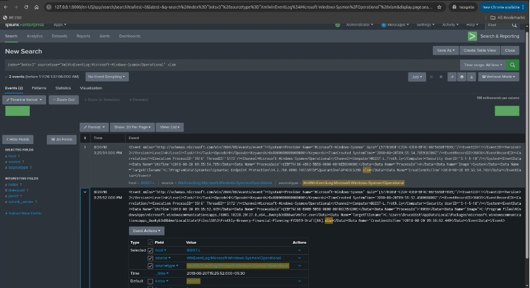
Fig. 7 shows Sysmon evidence referencing the spreadsheet and the executable.

### SOC interpretation
Sysmon is high-value because it can confirm execution rather than only delivery. The presence of HxTsr.exe associated with the XLSM trail indicates a likely payload stage: a malicious process being invoked after the user interacts with the document (or a chained process initiated by it). At this stage, SOC confidence increases significantly because behaviour is no longer merely “suspicious content,” but an observable endpoint action [6].

### SOC next steps
- Find all occurrences of HxTsr.exe across endpoints (Image=...) and extract hashes.
- Identify parent process / command line for context.
- Correlate with account activity and privilege changes (Q5/Q6).

---
## Q4 — Linux account creation evidence (persistence)

### Answer
ilovedavidverve

### SPL used
`index="botsv3" host=hoth sourcetype="osquery:results" useradd "columns.owner_uid"=0`

### Evidence
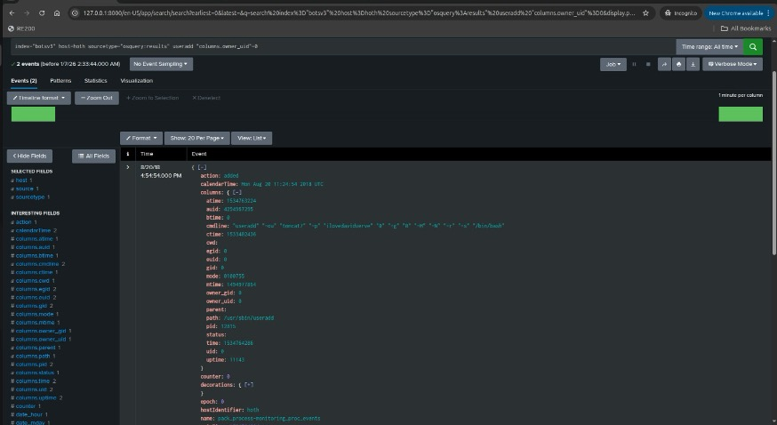
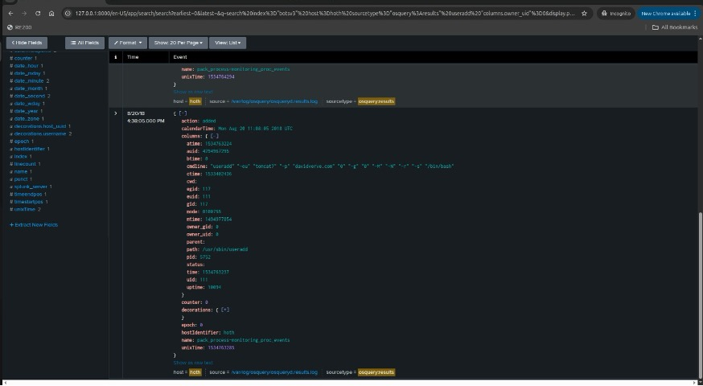
Fig. 8 and Fig. 9 show `useradd` with root context and the created username.

### SOC interpretation
Creating a new local account on a Linux host is a classic persistence action. The evidence shows root ownership (owner_uid=0), which strongly suggests privileged compromise. In SOC response practice, this is immediately actionable: the account must be disabled/removed, and authentication logs reviewed to determine if it was used for remote access [4].

### SOC containment actions (conceptual)
- Disable or remove the account and investigate authorized changes.
- Search for additional persistence on the host (cron/systemd/SSH keys).
- Review suspicious listening services (Q7) and process lineage.

---
## Q5 — Windows account creation

### Answer
svcvnc

### SPL used
`index=botsv3 sourcetype=WinEventLog:Security EventCode=4720`

### Evidence
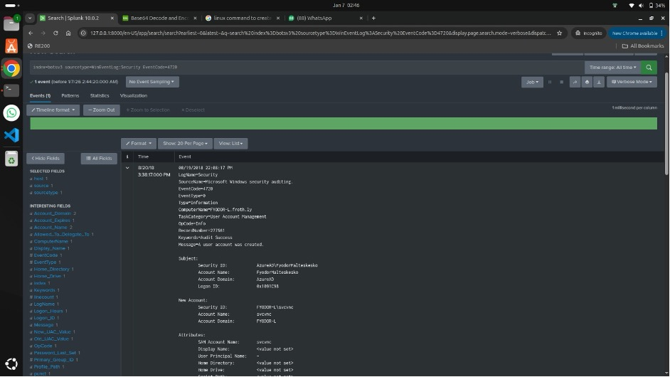
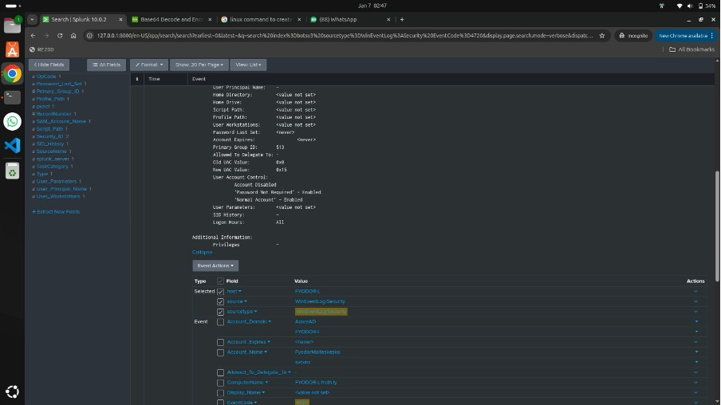
Fig. 10 and Fig. 11 show EventCode 4720 for a new user account.

### SOC interpretation
Windows account creation is a high-severity signal when unexpected. The account name `svcvnc` appears “service-like,” which is a common attacker tradecraft: choose names that blend into administrative noise. This is a major pivot point for escalation: from “possible compromise” to “confirmed identity manipulation.” [8]

### SOC next steps
- Determine who created the account (subject fields, creator identity).
- Search for subsequent logons or service creation by this account.
- Correlate with privileged group membership changes (Q6).

---

## Q6 — Groups the Windows account was added to (privilege escalation)

### Answer
administrators,user

### SPL used
`index=botsv3 sourcetype=WinEventLog:Security (EventCode=4728 OR EventCode=4732 OR EventCode=4756 OR EventCode=4729 OR EventCode=4733 OR EventCode=4757) svcvnc`

### Evidence
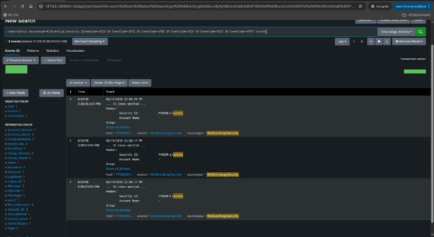
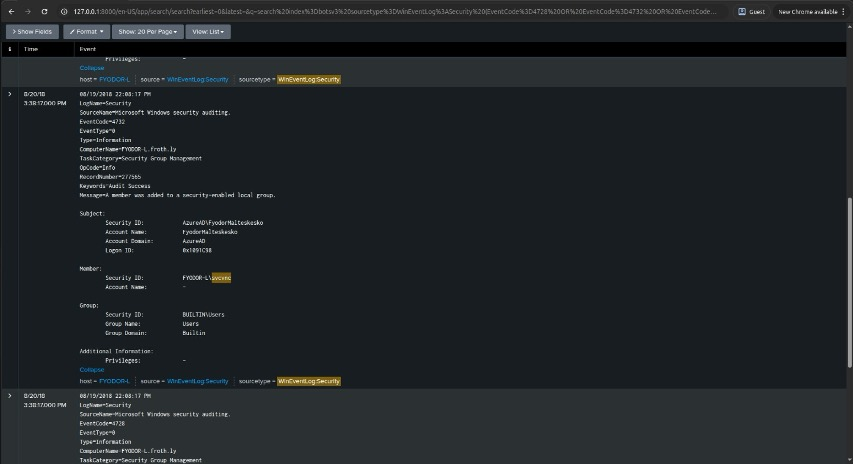
Fig. 12 and Fig. 13 show membership activity tied to `svcvnc`, including `BUILTIN\Administrators` and `user`.

### SOC interpretation
This is one of the strongest “incident confirmation” points in the Q1–Q8 chain. A newly created account being added to Administrators means the attacker has successfully established privileged access. In a real environment, this is escalation-worthy immediately: privileged access enables disabling defenses, dumping credentials, running remote services, and lateral movement [5].

### SOC response (conceptual)
- Remove account from Administrators, disable the account, and reset affected credentials.
- Identify all hosts where the account was used.
- Trigger a broader hunt: other accounts created near the same time window.

---
## Q7 — PID listening on port 1337 (potential backdoor/service)

### Answer
14356

### SPL used
index=botsv3 host=hoth sourcetype=osquery:results 1337 (listening OR LISTEN)
| table _time columns.address columns.port columns.protocol columns.state columns.pid columns.process_name
| sort - _time

### Evidence
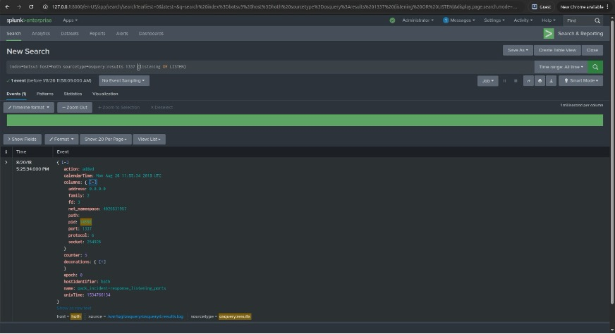
Fig. 14 shows port 1337 listening with PID 14356 and address 0.0.0.0.

### SOC interpretation
A listening port on 0.0.0.0 means the service is reachable on all interfaces, which increases risk. Port 1337 is commonly associated (in training and attacker culture) with non-standard services/backdoors rather than business applications. SOC investigation would pivot from PID to binary path and hash, and then check whether there are inbound connections or command-and-control patterns.

---

## Q8 — MD5 hash from Sysmon process creation

### Answer
586ef56f4d8963dd546163ac31c865d7

### SPL used
index=botsv3 sourcetype="XmlWinEventLog:Microsoft-Windows-Sysmon/Operational" "<EventID>1</EventID
>" Hashes MD5 host="FYODOR-L"
NOT "C:\\Windows\\system32\\cmd.exe"
NOT "C:\\Windows\\system32\\svchost.exe"
NOT "C:\\Windows\\explorer.exe"
NOT "C:\\Windows\\System32\\WindowsPowerShell\\v1.0\\powershell.exe"
NOT "C:\\Windows\\System32\\services.exe"
NOT "C:\\Windows\\system32\\cleanmgr.exe"
NOT "C:\\Windows\\Temp\\unziped\\lsof-master\\l\\explorer.exe"
svcvnc

### Evidence
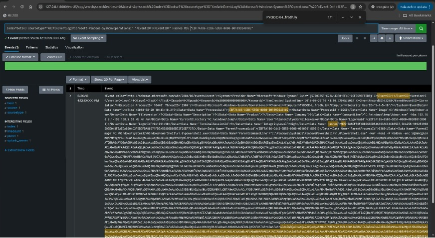
Fig. 15 shows Sysmon EventID 1 and the MD5 value.

### SOC interpretation
Hashes turn behavioural suspicion into operational hunting. Once a hash is extracted, SOC teams can quickly search across endpoints and time ranges for recurrence. While MD5 is not modern cryptographic integrity, it remains commonly used in operational hunting as a lightweight identifier. In practice, SOC would enrich this hash with internal threat intel, EDR sightings, and reputation sources, then decide whether to block [7].

---

# 5. Conclusion

## 5.1 Chain-of-evidence narrative
Q1–Q8 collectively describe a coherent, SOC-plausible incident progression:

1. Cloud anomaly (Q1): Unusual User-Agent accessing .lnk objects suggests suspicious or automated access in the Microsoft 365 environment.
2. Delivery via email (Q2): Macro-enabled spreadsheet indicates phishing-like delivery.
3. Execution (Q3): Sysmon shows a suspicious executable associated with document activity.
4. Persistence/Identity manipulation (Q4, Q5): New accounts appear on Linux and Windows, suggesting persistence and expansion of control.
5. Privilege escalation (Q6): The Windows account is granted Administrator membership, indicating high-impact compromise.
6. Possible backdoor/service (Q7): A process listens on port 1337, potentially enabling remote control.
7. IOC extracted (Q8): Hash supports scoping, hunting, and prevention.

## 5.2 Detection engineering recommendations (SOC strategy)
To prevent or detect similar patterns earlier, the SOC should implement layered detections.

Table 2: Recommended detections derived from Q1–Q8
(Insert Table 2 here)

## 5.3 Response playbook improvements
- Establish a playbook that triggers when account creation and admin group assignment are observed together (disable account + remove privileges + investigate creator).
- Build a standard “macro attachment response” workflow: quarantine email, notify recipients, hunt for file execution, and isolate hosts if Sysmon confirms suspicious payloads.
- Ensure that endpoint telemetry coverage is consistent across the fleet (Sysmon + Windows auditing + osquery) so that investigations do not rely on one log source.

---

# References
[1] A. Nelson, S. Rekhi, M. Souppaya, and K. Scarfone, “Incident Response Recommendations and Considerations for Cybersecurity Risk Management”:, NIST, Apr. 2025, doi: https://doi.org/10.6028/nist.sp.800-61r3. Available: https://nvlpubs.nist.gov/nistpubs/SpecialPublications/NIST.SP.800-61r3.pdf  
[2] Splunk, “Boss of the SOC (BOTS) Dataset Version 3,” GitHub, Mar. 26, 2022. Available: https://github.com/splunk/botsv3  
[3] NIST, “Cybersecurity Log Management Planning Guide,” Cybersecurity Log Management Planning Guide, Jan. 2023, doi: https://doi.org/10.6028/nist.sp.800-92r1.ipd  
[4] MITRE Corporation, “Create Account: Local Account, Sub-technique T1136.001 - Enterprise | MITRE ATT&CK®,” attack.mitre.org, 2020. Available: https://attack.mitre.org/techniques/T1136/001/  
[5] Microsoft, “Audit Security Group Management - Windows 10,” learn.microsoft.com, Sep. 06, 2021. Available: https://learn.microsoft.com/en-us/previous-versions/windows/it-pro/windows-10/security/threat-protection/auditing/audit-security-group-management  
[6] MITRE ATT&CK, “Phishing, Technique T1566 - Enterprise | MITRE ATT&CK®,” attack.mitre.org, Mar. 02, 2020. Available: https://attack.mitre.org/techniques/T1566/  
[7] Microsoft Sysinternals, “Sysmon - Windows Sysinternals,” learn.microsoft.com, Jul. 23, 2024. Available: https://learn.microsoft.com/en-us/sysinternals/downloads/sysmon  
[8] Microsoft, “4720(S) A user account was created. - Windows 10,” learn.microsoft.com, Sep. 07, 2021. Available: https://learn.microsoft.com/en-us/previous-versions/windows/it-pro/windows-10/security/threat-protection/auditing/event-4720  

---

# Appendix
- Youtube link : https://youtu.be/sW-e9kXZ7CY  
- GitHub reposotory: (add link here)
